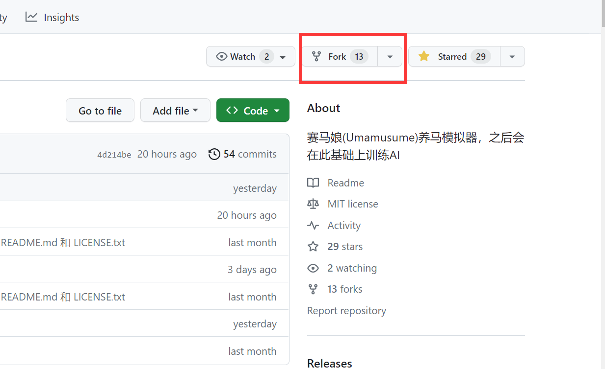
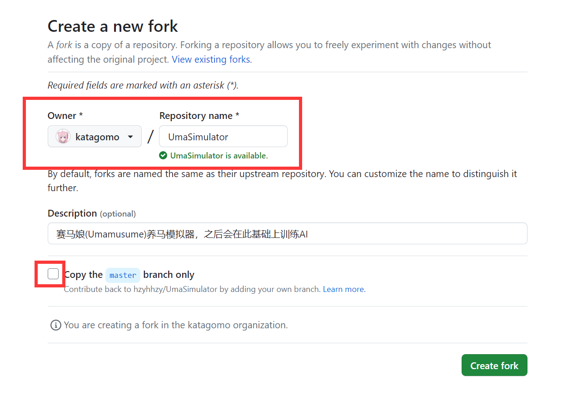
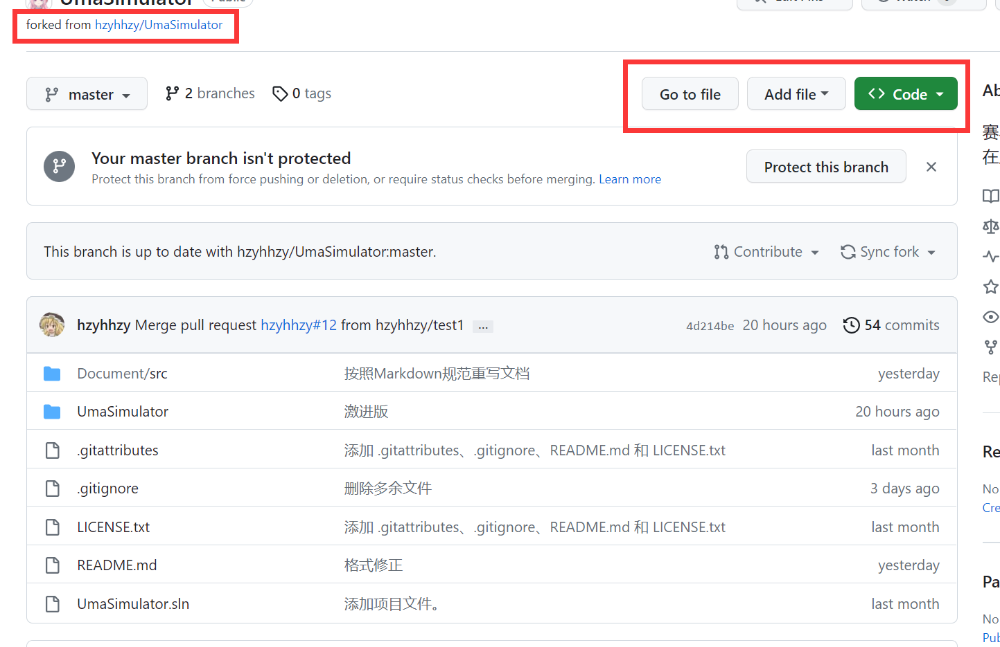
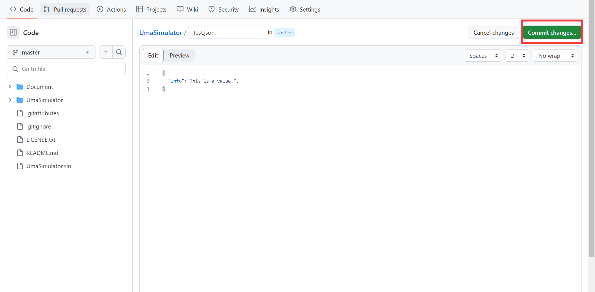
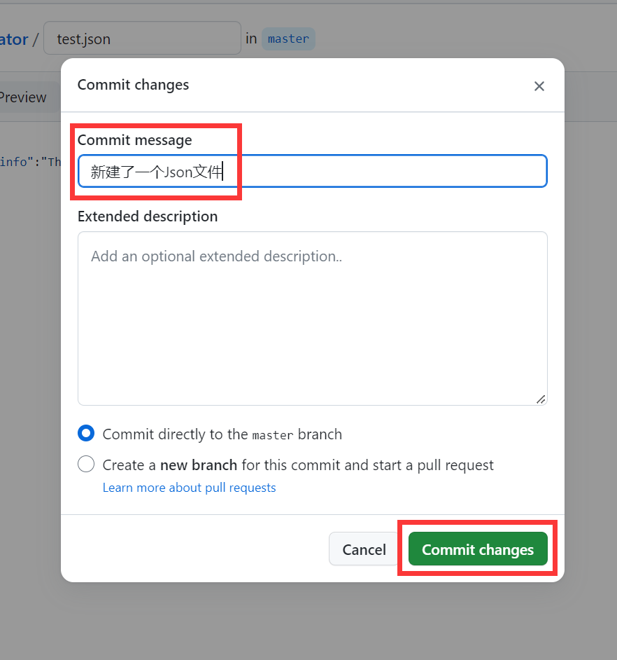
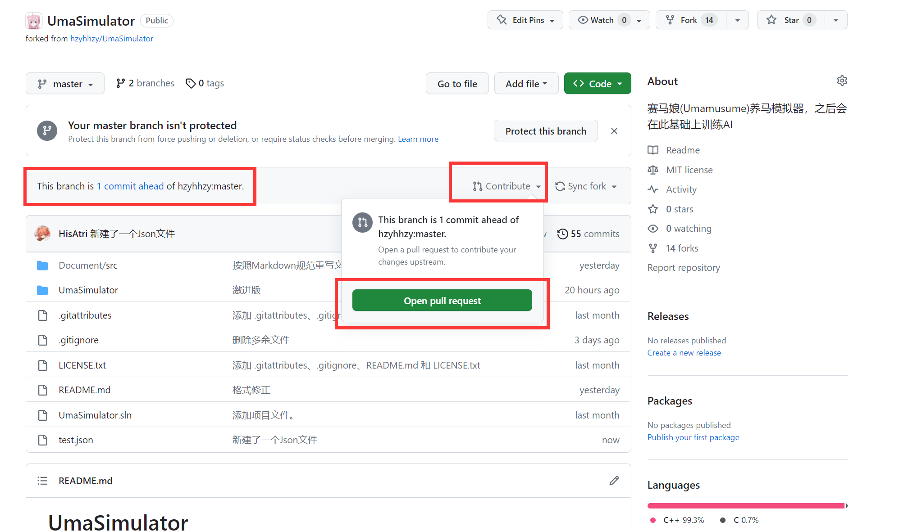
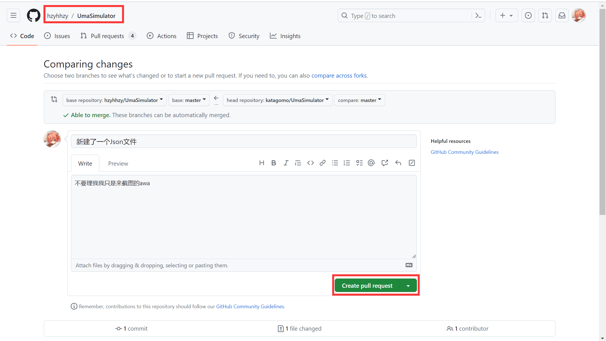
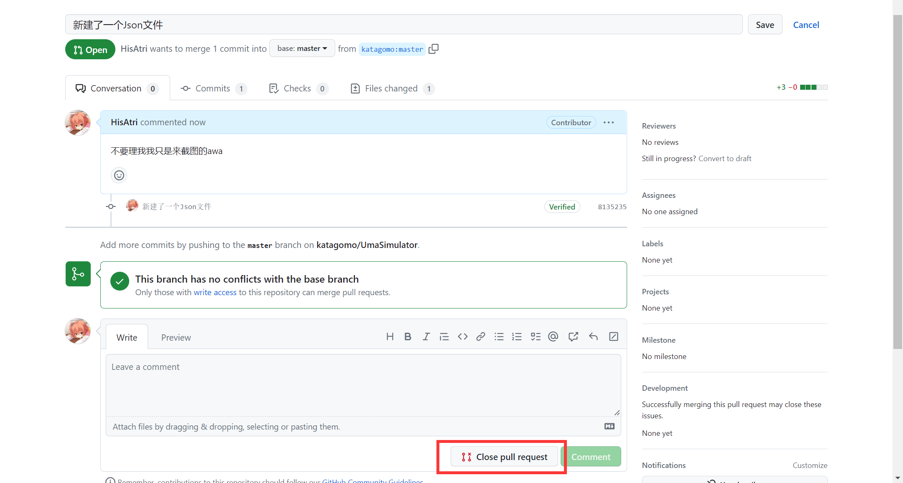

# 纯网页端PR教程

1.进入项目主仓库，Fork一份代码

如果看到如下的"forked from hzyhhzy/UmaSimulator"，那么说明这个仓库已经Fork到你自己的仓库里了。

2.开始动手修改

"Go to file"可以快速地进入项目文件进行搜索

"Add file"可以快速向项目中添加一个文件

如果会使用Git Bash，你也可以通过"<>Code"获取仓库的Git链接

修改或新建一个文件。如果修改好了，请点击“Commit Changes”确认你的更改。

填写清除你修改的内容，例如“增加了一个马娘”；继续点击“Commit Changes”

3.提交PR

现在回到项目的主仓库，可以看到“This branch is 1 commit ahead of hzyhhzy:master.”，这说明你的仓库相对于原仓库有新的更改。点击“Sync Fork”从原仓库你的仓库，然后点击“Contribute”，继续点击“Open pull requests”，正式向原仓库提交你的合并请求。

注意：Sync Fork一般情况下不会影响你的改动，但是如果合并时出现冲突，请先检查一下原始仓库的近期改动。

现在跳转到了原仓库，请清晰地说明自己做了哪些改动，然后点击“Create Pull Request”

4.等待项目管理员审核PR，

你可能需要按照修改意见继续进行修改。新的修改会自动同步到当前Pull Request中，无需新建PR。

如果无需当前更改，或者你需要撤销这个PR，可以点击下方的“Close Pull Request”关闭当前PR。

