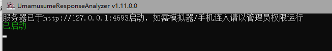
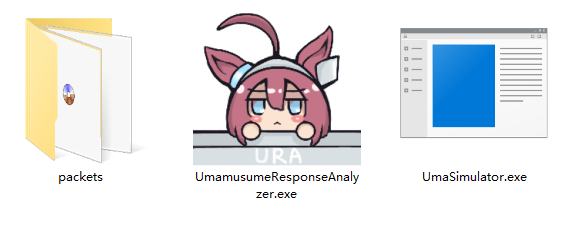
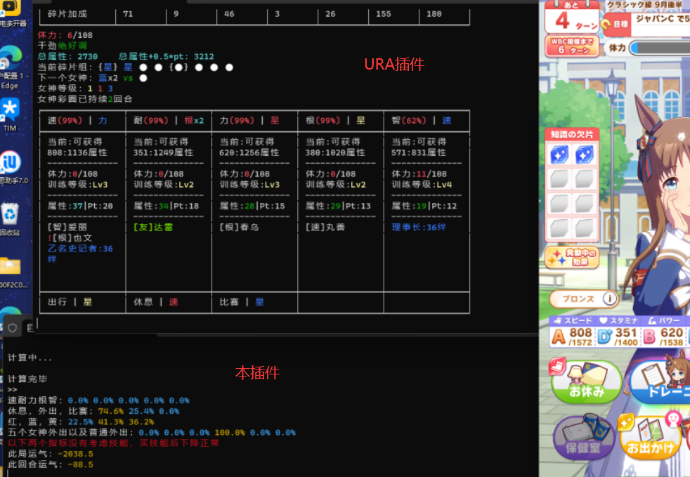
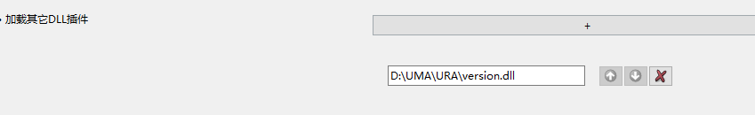
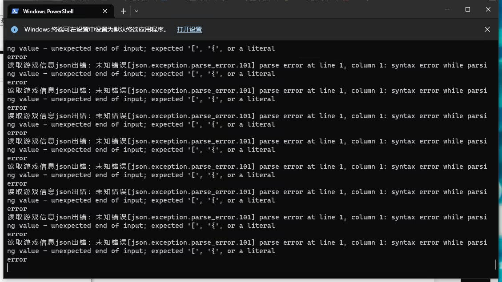
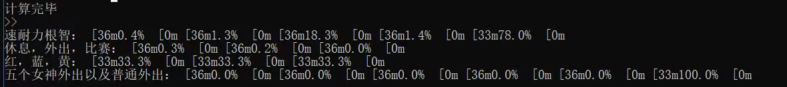
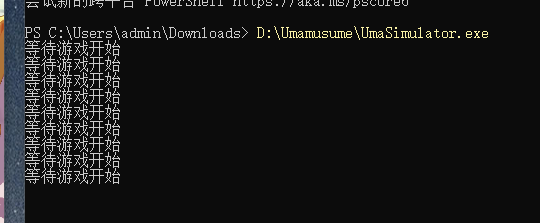

# UmaSimulator

## 简介

一个快速开发中的女神杯剧本育成辅助工具，基于UmamusumeResponseAnalyzer（以下简称URA）的游戏数据，使用预设策略和蒙特卡洛模拟给出当前回合的育成选择建议。

仅限于日服DMM端女神杯剧本使用。

**在线文档：**<https://docs.qq.com/doc/DYnJLY01hd0pYeWFz>

**讨论群：751367941**

## 特别声明

- **本插件仅对育成选择进行提示，不包含任何违反游戏使用条款的行为。** **（包括但不限于抓取游戏通信、修改数据、自动操作等）** 计算结果仅供玩家参考，最终的游戏结果仍然取决于玩家自己的操作。
- **本项目依赖于UmamusumeResponseAnalyzer，该工具会抓取游戏通信数据**，对这一工具的**滥用**（包括但不限于透视打针等选项结果）**会导致账号被警告、封禁，造成的后果由用户自行担责**。
- **使用本插件完全免费。** 根据中华人民共和国《计算机软件保护条例》第十七条规定：「为了学习和研究软件内含的设计思想和原理，通过安装、显示、传输或者存储软件等方式使用软件的，可以不经软件著作权人许可，不向其支付报酬。」本插件仅供用户交流学习与研究使用，用户本人下载后**不能用作商业或非法用途，严禁转售、转卖。**需在24小时之内删除，否则后果均由用户承担责任。
- 不允许在直播中出现本工具的界面画面或者截图
- 复制本插件需要附带本声明文本。

## 项目贡献者（Github）

<a href="https://github.com/hzyhhzy/UmaSimulator/graphs/contributors">
  
</a>

## 如何使用GitHub参与开发？

[GitHub PR流程](Document/PullRequests.md)

## 安装与使用

- 仅限日服PC DMM端使用
- URA插件：需要使用压缩包内的魔改版本

### 运行方法

- 目录结构：
  - UmaSimulator.exe - AI插件本体（需要运行）
  - UmamusumeResponseAnalyzer.exe - 魔改的小黑板（URA插件，需要运行）
  - version.dll / winhttp.dll - URA插件的组件
  - db - （新版）马娘/卡数据文件
  - packets - 正确运行URA插件后，由URA插件生成的捕获文件夹
  - aiConfig.json - 配置

    **运行顺序：URA插件 - 游戏本体 - UmaSimulator（AI）**

- 验证URA插件与游戏连接
  - URA插件和本插件不需要放在游戏文件夹内，最好单独放一个文件夹。
  - 将Version.dll（或winhttp.dll）覆盖到游戏所在文件夹（如果需要使用汉化插件则跳过此步，参考下面步骤e）
  - 关闭游戏
  - 启动URA插件，在窗口里选择“启动” （注意不要选择“更新程序”）
    
  - 打开游戏，进入殿堂马娘或JJC画面，如果URA插件窗口中显示Box信息则说明连接成功
  - 进入‘育成’画面，如果URA插件所在文件夹下有“packets”目录则连接成功
  - 此时进入育成，应该可以看到事件选项等数据。
- URA和游戏连接成功后，即可启动本插件UmaSimulator.exe。注意UmaSimulator.exe和packets目录需要在同一文件夹内

    
    

- *（注：今后预计会整合到URA中，这样就不用单独开启了）正确启动效果如图所示*

- “计算完毕”结果处会显示当前回合的选择建议。玩家可以根据建议手动选择训练项目
  - 速耐力根智：应选择概率高的
  - 休息外出比赛：同上，一般只在训练不好时选择
  - 红蓝黄：该回合如果出现女神三选一事件，推荐选择的属性。
  - 外出：依次为女神事件1-5和普通外出的推荐度
  - 本局运气：反映整局的欧非程度，平均值为0
  - 此回合运气
  - 比赛损失：越接近0，损失越小，可以考虑在当回合进行自选比赛
- URA和汉化插件（Trainer-legend-G）的联动方法
  - 不要把本插件的Version.dll放进游戏目录或覆盖TLG的同名文件
  - 在汉化插件的设置中，连锁加载URA的version.dll
  
  - 先运行URA，再启动游戏和汉化插件
- 育成技巧与提示
  - 推荐根据概率最高的来选。当然最终决定权还在训练员手上。如果没有选择推荐的，在下一回合也会重新分析当前策略。
  - AI策略还在优化中，如果碰到明显有问题的决策需要自己动动脑子。
  - 目前不对自选生涯比赛进行处理，玩家需要根据“比赛损失”分数，自行决定出赛的回合。
  - 目前不考虑卡红女神，玩家需要自行控制。
  - 卡和马突破、星数不限，但是低破会影响计算结果。
  - 建议频繁清理packets文件夹的内容
  - 事件选项可以参考ura，但是滥用URA的透视功能会导致封号，请谨慎使用该插件

### 常见问题

*故障排除提示：不运行游戏和URA插件时也可以利用本地的packets文件夹内容，单独运行本插件进行排错，直到显示正常*

- 找不到packets/currentGS.json

    解决：**参考安装步骤（B）首先解决URA插件连接问题。**

    （1）先打开游戏，再打开URA插件；

    （2）进入殿堂马或者竞技场选人画面，确认URA有数据显示

    （3）进入育成，确认当前目录下有packets文件夹

    注意需要使用**魔改版URA插件**才会生成packets文件夹。原版或者点击了更新插件则不会生成

- 错误刷屏：读取游戏数据Json出错
  
  - 解决：删除packets中全部文件再启动
- 颜色字乱码
  
  - 解决：使用新版（无颜色或者颜色兼容版）插件，或者使用Windows Terminal运行本插件
  - 修改aiConfig.json 设置 "noColor": true, （注意不要漏了最后的逗号）
- 等待游戏开始，但已经在育成画面
  
  - 解决：工作目录不对
  - 新版插件基本解决了工作目录问题；
  - 如果使用老版本插件，需要在命令行中CD到插件目录下运行。
- 显示“未知卡”“未知马娘”或闪退
  - 解决：目前只支持列表中的马娘和卡。突破和星数不限。请检查卡组

- “没有找到”packets但是URA可以正确工作

    解决：工作目录不对，需要CD进到URA/UmaSimulator所在文件夹运行这两个工具

    （packets生成到当前工作目录（别的目录）里去了）

    注意：需要使用魔改版小黑板才能生成packets文件夹，如果点击了“更新本插件”下载的最新版是不会生成的。

- 自己编译exe，显示“正在计算”后很慢或者卡死

    解决：Debug版会很慢，原因不明；Release版可以正常计算

- 找不到\*.dll

    解决：更新/使用release版本

- 代码显示乱码

    解决：改用GBK编码载入

- 卡片、马娘识别错位，其他不明原因闪退

    请联系开发者

## 支持的角色和支援卡

卡和马突破、星数不限，但是低破会加大计算误差。

### 目前支持的马娘

| 特别周     | 泳装特别周 | 总大将特别周 |
|------------|------------|--------------|
| 草上飞     | 花炮       | op炮         |
| 小林历奇   | 水麦昆     | 无声铃鹿     |
| op帝王     | 火鸡帝王   | 爱丽数码     |
| 僵尸数码   | 荒漠英雄   | 内恰         |
| 啦啦队内恰 | 水船       | op司机       |
| op帽       | 圣诞帽     |              |

### 7.28更新：群友提供的马娘数据（在群文件中下载）

| 大和赤骥-原皮 | 真机伶-原皮/换皮 | 奇锐骏        |
|---------------|------------------|---------------|
| 醒目飞鹰-换皮 | 春光钻           | 大拓太阳神    |
| 春黑（北白）  | 新宇宙           | 星云天空-原皮 |
| 米浴-原皮     | 神鹰-原/换       | 双涡轮        |
| 稻荷一-原/换  | 多伯-原/换       | 大树-原/换    |
| 北港火山      | 天狼星           | 葛城王牌      |
| 乌拉拉-原/换  | 黄金城-原/换     |               |

欢迎编辑、提交更多马娘

### 支援卡（对应3.0版）

| **[友]神团**            | [智]高峰                        |
|-------------------------|---------------------------------|
| [智]美妙                | [根]乌拉拉                      |
| [根]风神                | [速]司机                        |
| [根]凯斯-SSR            | [根]皇帝                        |
| [根]善信                | [速]宝穴                        |
| [耐]海湾                | [智]好歌剧                 |
| [根]黄金城-SSR          | [智]波旁**-应援（金地固）** |
| [耐]狄杜斯              | [智]小栗帽                      |
| [根]狄杜斯              | [速]北黑                        |
| [速]福来                | [速]速子                        |
| [耐]光钻                | [耐]桂冠                        |
| [力]白仁                | [力]重炮                        |
| **[力]**内恰            | [力]神鹰                        |
| [力]伏特加              | [根]涡轮                        |
| [根]进王                | [根]青竹                        |
| [根]小栗帽sr            | [根]织姬sr                      |
| [根]气槽sr              | [根]采珠sr                      |
| [智]东海帝宝            | [智]庆典                        |
| [智]CB                  | [智]小魔女-SSR                  |
| [智]气槽                | [智]太阳神-SSR（夏日）          |
| [智]星云sr              | [智]速子sr                      |
| [智]大和sr              | [智]福来sr                      |
| [根]也文                | [耐]特别周                      |
| [根]特别周**-主线**      | [速]阿尔丹                      |
| [智]内恰                | [力]八重                        |

## 参与开发

<https://github.com/hzyhhzy/UmaSimulator>

项目在快速迭代中，欢迎Fork，提交Pull Request

欢迎AI大佬加入改进算法

讨论群：751367941

开发工具：Visual Studio

无特别依赖项

Debug版计算会很慢，原因不明；Release版可以正常计算

\*注意：以下内容可能随时修改和优化。

## aiConfig.json 设置项（新版本）

**这里列出的是默认值**

```
{  
    "noColor": false, // 开关结果的颜色显示，为True时不显示颜色（适配部分终端）  
    "radicalFactor": 5, // 激进度，越高就越不稳定（越“凹”）  
    "threadNum": 12, // 线程数量  
    "searchN": 12288, // 迭代次数，越小速度越快但评分损失越大  
    "debugPrint": true // 计算时是否显示额外的调试输出  
}
```

searchN设置值参考：12288为推荐的标准值。

可以参考[**Fritz Chess**](http://www.downyi.com/downinfo/60435.html)的跑分值，根据自己CPU性能调整，推荐设置为**跑分值除以3**

## 怎么添加新马（新版本）

在线编辑器（by だ☆ぜ）：<https://je.eh.cx/>

直接在**db\\uma**文件夹下新增对应的json文件即可。

**注意！编码必须为UTF-8**

**注意不要留空字段，或者和已有的马娘gameID字段重复**

需要重新启动程序。如果正确载入会在启动时显示

###
