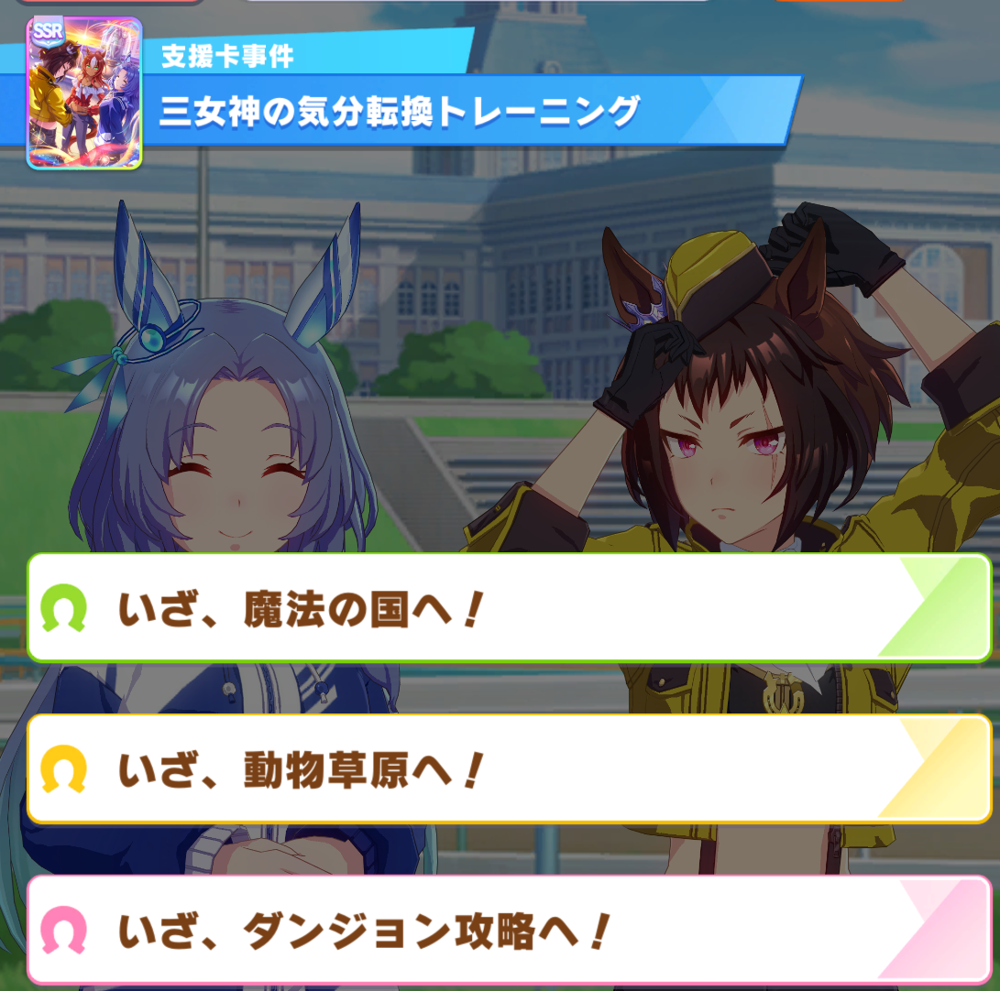

# 凯旋门剧本的ai预计还需要一个月   
# The AI of the LArc scenario will take about one month   

# UmaAi使用说明

更新时间 2023-08-13
   
# 1.简介

一个开源的女神杯剧本育成辅助工具，可以给出 **评分最大化** 的训练建议，用于获得 **高分** 。

预设策略和蒙特卡洛模拟给出当前回合的育成选择建议。

仅限于 **日服  DMM端 女神杯剧本 凹分(追求高评分)** 使用。

以后会支持新的剧本。但是老剧本（URA、青春杯、巅峰杯、偶像杯）不会支持

目前只支持**简体中文环境**，在其他语言环境下可能会出乱码

源代码：[https://github.com/hzyhhzy/UmaAi](https://github.com/hzyhhzy/UmaAi)

配套修改版小黑板插件：[https://github.com/hzyhhzy/UmaAiConnector](https://github.com/hzyhhzy/UmaAiConnector)

（基于[https://github.com/UmamusumeResponseAnalyzer/UmamusumeResponseAnalyzer](https://github.com/UmamusumeResponseAnalyzer/UmamusumeResponseAnalyzer)）

QQ群：  **751367941** ，最新版的程序基本上都在QQ群里直接上传，github的release更新较为缓慢。入群问题：哪个训练不消耗体力？（我觉得这个问题应该够简单了，就不在这里写答案了）

作者QQ： **2658628026 (Sigmoid)**

**If it's inconvenient for you to join the QQ group, you can** **.**

# 2.特别声明

- **本插件仅对育成选择进行提示，不包含任何违反游戏使用条款的行为。**
**（包括但不限于抓取游戏通信、修改数据、自动操作等）**
**计算结果仅供玩家参考，最终的游戏结果仍然取决于玩家自己的操作。**
- **本项目依赖于UmamusumeResponseAnalyzer，该工具会抓取游戏通信数据 ，对这一工具的滥用（包括但不限于透视打针等选项结果）有可能导致账号被警告、封禁，造成的后果由用户自行担责。**
- **使用本插件完全免费。 根据中华人民共和国《计算机软件保护条例》第十七条规定：「为了学习和研究软件内含的设计思想和原理，通过安装、显示、传输或者存储软件等方式使用软件的，可以不经软件著作权人许可，不向其支付报酬。」本插件仅供用户交流学习与研究使用，用户本人下载后不能用作商业或非法用途，严禁转售、转卖。需在24小时之内删除，否则后果均由用户承担责任。**
- **不允许在直播中出现本工具的界面画面或者截图**
- **复制本插件需要附带本声明文本。**

# 3.项目贡献者

**Sigmoid (hzyhhzy)**：游戏模拟器，算法主体

 **库兰 (xulai1001)**：导出游戏支援卡解包数据，撰写使用说明，优化使用提示，以及许多细节优化

 **黄粱一梦 (Hzyuer)**：重构支援卡类，以及许多细节优化

 **某科学的超电磁灶 (HisAtri)**：细节优化，完善说明文档

**MichaelHalN** ， **zhuaajian** 等人：添加支援卡和马娘数据

# 4.安装

  
## a) 安装小黑板（UmamusumeResponseAnalyzer，简称URA）插件

首先，把压缩包里所有文件解压到任意一个文件夹里

打开UmamusumeResponseAnalyzer.exe（如图）

**（如果之前安装过小黑板，此步可跳过）** 更新数据文件，并自动安装ura-core， **不要"更新程序"**

若更新数据文件失败，则在"选项"里关闭"强制使用github更新"然后重试 

此插件与汉化插件（Trainers-Legend-G）可以兼容，如果先安装了汉化插件，在"自动安装ura-core"时会提示兼容模式

选择"启动！"后，开启游戏，若出现"**检测到ViewerID为xxxxxxxxx的帐号登录请求**"则说明安装成功

如果前一步"自动安装ura-core"失败，或者启动游戏并进入主界面后没有出现这一行字，可以手动安装ura-core，方法如下：

找到游戏所在文件夹（这个文件夹下有 等文件），然后将 复制到这个文件夹里。

  
## b) 开启ai

双击打开UmaAi.exe 

第一次打开时会出现如下提示，是正常现象， **育成开始后** 才会正常显示

若出现下图的界面，说明成功运行

若出现 **类似下图的乱码** ，请双击打开"修复不显示颜色（[0m乱码）（无此问题不要点）.reg" 

若提示“未知马娘”或“未知支援卡”（如下图），可能是马娘和支援卡太新还未收录，请等待作者更新数据发布新版本后下载。

# 5.使用

## a) AI数据解读

**速耐力根智** ：五个训练的推荐度

**休息，外出，比赛** ：休息外出比赛的推荐度

**Ai 推荐这两行（8个数字）里选最大的**

**女神三选一事件** ：如下图所示的事件。 **三个选项从上到下依次会给 红、蓝、黄 色的碎片** 。此行显示的数字为，如果当前回合点击女神出现了这个事件，Ai对三个选项的推荐程度

**五个女神外出以及普通外出** ：Ai对外出选项的推荐度，依次是红、蓝、黄外出、团队外出1、团队外出2、普通外出。

**运气** ："本局"是当前预测分相比刚开局的预测分的差距，"本回合"是此回合相比上回合的预测分变化。"评分预测"是对此局最终评分的预测，越后期越准。

**比赛亏损** ： **此Ai没有写关于粉丝数目标/自选比赛目标的处理** ，需要自选比赛时，可以参考这个分数。这个分数代表比赛相比训练亏损的分数，一般来说小于150即可参加比赛完成目标。

**XXXX的建议**：将ai的决策转化成语言。可以修改aiConfig.json和db/roleplay.json更改设置

当凑够8个碎片出现女神睿智时，会增加一行（如上图）：

**使用女神率：** 当前回合使用女神睿智的推荐程度。若 **大于50%**则推荐使用女神。

注意，此时推荐的训练是在ai自己决定是否使用女神的前提下计算的。若没有根据ai的建议使用/不使用女神，请自己决定选什么训练。

   
## b) 各种参数与设置

用记事本打开aiConfig.json，如下图所示

**noColor** ：是否关闭颜色。此设置已无用，遇到乱码可以参考b)部分的说明

**radicalFactor** ：激进度。激进度表示了ai对这局运气的自信程度。激进度=0表示平均（不保守也不激进），但不可以设负数。如果打算养很多局冲上限，可以设较高的激进度，但建议不要超过10。默认值5适合大部分凹分情况。

**threadNum** ：ai使用的cpu线程数。建议设成和自己的cpu一样的线程数，如果导致电脑卡顿，可以减小。

**searchN** ：蒙特卡洛计算量（程序内部模拟育成的局数）。Ai计算消耗的 **时间正比于此参数** ，电脑配置较低运行较慢时，可以适当减小这个参数。但是 **计算量越低随机误差越大** ，不建议小于3000。此外，激进度越大需要越高的计算量才可达到相同的计算误差，激进度为5时相比激进度0约需要2倍计算量，10相比0约为3倍。

**extraCardData** ：支援卡兼容模式。如果使用db/card文件夹里没有的卡，开启extraCardData后会加载db/cardDB.json里的数据，即可正常使用ai。但是因为兼容模式使用的数据库不包括固有词条，所以 **对于**** db/card ****文件夹里没有的卡，存在较大误差** 。（开启此设置不影响db/card里有的卡）

**debugPrint** ：计算时是否显示进度条

**role** ：ai的提示词风格，暂时有三种：default（经典版），greencap（骏川手纲），aoi（桐生院），可以在db/roleplay.json里修改或增添。

  
## c) 注意事项

1. **目前ai不对自选生涯比赛进行处理** ，玩家需要根据"比赛损失"分数，自行决定出赛的回合。

2. 卡和马突破、星数不限，但是 **低破或者db/card里没有的卡会影响计算结果**。

3. **马娘自身的特殊事件** （比如成田大进的"练习下手"事件以及随后的赛后全属性加成，以及黄金城的比赛全属性加成等） **暂时没有收录** ，需要自己干预。

4. 由于使用了蒙特卡洛算法，ai的计算有 **随机误差（约20%）** （比如，重启一下ai，计算结果与上一次的通常会有一定的偏差，这是正常现象）。计算量越大，激进度越低，随机误差越小。对于女神外出顺序，以及女神三选一事件，若显示的概率较接近（差距小于一倍），可以自己根据游戏理解决定选哪个。（例如，女神外出3（黄）一定早于女神外出2（蓝））

5. 事件选项可以参考 **小黑板（URA插件）** ，但是滥用小黑板的透视功能 **存在封号的可能性** ，请谨慎使用该插件

6. ai完全没有考虑技能， **对于[智]目白高峰等固有词条涉及到技能的支援卡（下图），需要自己手动购买技能，ai不会提醒你！**

# 8.算法

在育成模拟器里通过蒙特卡洛法估测出来每个选项的平均最终分数。

## 育成模拟器

游戏机制和各种计算公式尽可能逼近真实育成（主要在game.cpp里）。

游戏机制和公式，参考如下文档：

[https://wiki.biligame.com/umamusume/%E5%9F%BA%E7%A1%80%E8%AE%AD%E7%BB%83%E6%8F%90%E5%8D%87%E5%80%BC](https://wiki.biligame.com/umamusume/%E5%9F%BA%E7%A1%80%E8%AE%AD%E7%BB%83%E6%8F%90%E5%8D%87%E5%80%BC)

[https://wiki.biligame.com/umamusume/%E5%89%A7%E6%9C%AC%22%E5%A4%A7%E5%B8%88%E6%9D%AF%22%E7%AE%80%E4%BB%8B](https://wiki.biligame.com/umamusume/%E5%89%A7%E6%9C%AC%22%E5%A4%A7%E5%B8%88%E6%9D%AF%22%E7%AE%80%E4%BB%8B)

[https://ogatetsu.shop/entry/2023/03/26/support-card-compare-tool](https://ogatetsu.shop/entry/2023/03/26/support-card-compare-tool)

除此以外还有一些纠错与实测

## 手写逻辑

Evaluator.cpp里，对每个训练的属性、体力、pt、碎片、女神等进行简单估分并相加，对休息/外出也打分，选出分数最高的训练（或者休息外出）。

## 蒙特卡洛法

小黑板将游戏中当前回合训练信息（当前属性、体力、人头分配、每个训练加的属性以及pt以及体力消耗等）通过一个json文件传递给ai。

ai在育成模拟器中还原当前游戏状态。在模拟器里模拟点击某个训练，并使用"手写逻辑"一直模拟育成到最后一个回合，获得最终分数。对于每个训练，模拟育成searchN局（约10000，可以调节），计算平均分数。当激进度大于0时，使用加权平均分数，越高的分数使用越大的权重。

每个回合考虑如下选择，每个选择通过蒙特卡洛法计算分数，并取最大值作为推荐选项：

1.训练选哪个（速耐力根智，休息，外出，比赛，共8种）

2.外出选哪个（5种神团外出+普通外出=6种），

3.如果成功点出三选一事件，选什么颜色的碎片（3种）。

共8+6+3=17种选择。

4.如果当前回合有女神睿智，则对于开启睿智和不开启睿智，分别计算17种选择的分数，共2\*17=34种

## 存在的问题

ai做出的决策，当前回合是通过蒙特卡洛法决定的，但是下一个回合之后都是手写逻辑。手写逻辑不能考虑较复杂的策略（比如过几个回合吃红女神回体之类的），因此目前这个ai并不能思考2回合以上的策略。下个剧本如果需要较复杂的思考，会加入神经网络代替手写逻辑。