# UmaAi使用说明

更新时间 2023-12-23
   
# 1.简介

一个开源的凯旋门剧本育成辅助工具，可以给出 **评分最大化** 的训练建议，用于获得 **高分** 。

基于神经网络模型和蒙特卡洛模拟给出当前回合的育成选择建议。

仅限于 **日服 DMM端 凯旋门杯剧本 凹分(追求高评分)** 使用。为了便于维护和更新，不会支持老剧本。

目前只支持**简体中文环境**，在其他语言环境下可能会出乱码

源代码：[https://github.com/hzyhhzy/UmaAi](https://github.com/hzyhhzy/UmaAi)

配套修改版小黑板插件：[https://github.com/hzyhhzy/UmaAiConnector](https://github.com/hzyhhzy/UmaAiConnector)

（基于[https://github.com/UmamusumeResponseAnalyzer/UmamusumeResponseAnalyzer](https://github.com/UmamusumeResponseAnalyzer/UmamusumeResponseAnalyzer)）

QQ群：  **751367941** ，最新版的程序基本上都在QQ群里直接上传，github的release更新较为缓慢。入群问题：哪个训练不消耗体力？（我觉得这个问题应该够简单了，就不在这里写答案了）

作者QQ： **2658628026 (Sigmoid)**

**If it's inconvenient for you to join the QQ group, you can**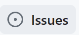 **.**

# 2.特别声明

- **UmaAI（下称为：本插件）仅对育成选择进行提示，计算结果仅供玩家参考。最终的游戏结果完全取决于玩家自己的操作。**
- **本插件使用UmamusumeResponseAnalyzer（下称为：小黑板）获取游戏数据。该工具获取的游戏数据，仅用于更直观、准确地展示育成中的训练数值和事件效果。不会修改任何游戏数据或者进行任何自动操作。**
- **本插件属于游戏的第三方插件，使用本插件可能会违反游戏的使用协议，导致的一切后果，包括但不限于账号被警告、封禁等，由用户自行承担。**
- **不得在视频或直播中出现本工具的界面画面或者截图。这会显著增加您的账号或者本工具被封禁的风险。**
- **使用本插件完全免费；本插件仅供用户交流学习与研究使用，用户本人下载后不能用作商业或非法用途，严禁转售、转卖。**
- **软件是“按原样”提供的。在任何情况下，作者或版权持有人均不对因软件的使用而产生的纠纷承担任何责任。The Software is provided “as is”, without warranty of any kind. In no event shall the authors or copyright holders be liable for any claim, out of or in connection with the software.**
- **复制本插件需要附带本声明文本。**

    Additional Notes:
    本ツールは、PC(DMM)版ウマ娘にのみ対応しています。スマートフォン版ではご利用いただけません。

    本ツールは、情報の視認性を高めることでより快適なゲーム体験を提供し、トレーナーがウマ娘をより楽しんで遊べることを目的に開発されました。

    本ツールは、ウマ娘の利用規約に違反していると判断される可能性があることをご了承ください。お使いいただく場合は、自己責任で行っていただきますようお願いいたします。

    なお、ウマ娘本体の更新などにより予期せぬ動作をする可能性があります。ご了承ください。

# 3.项目贡献者

**Sigmoid (hzyhhzy)**：游戏模拟器，算法主体

 **库兰 (xulai1001)**：导出游戏支援卡数据，撰写使用说明，优化使用提示，以及许多细节优化

 **黄粱一梦 (Hzyuer)**：重构支援卡类，以及许多细节优化

 **某科学的超电磁灶 (HisAtri)**：细节优化，完善说明文档

**MichaelHalN** ， **zhuaajian** 等人：添加支援卡和马娘数据

# 4.安装

## a) 压缩包内容说明

- UmaAi神经网络版（Nvidia显卡专属）.exe：神经网络版AI主文件，目前只支持N卡。负责计算并将结果输出到小黑板。双击启动后可以将其最小化。
- UmaAi非神经网络版（CPU）.exe：非神经网络版AI主文件，非N卡或者神经网络版闪退可以用这个。
- 小黑板URA.exe：负责获取游戏数据以及和AI通信。现在版本AI会将计算结果发送给小黑板，在小黑板画面中可以显示完整的回合信息和AI建议。为了确保小黑板和游戏正常连接，建议先启动小黑板再启动游戏。
- aiConfig.json / aiConfig_cpu.json：分别是神经网络版和非神经网络版的配置文件。
- db文件夹：存放模型、马娘和支援卡数据。数据是跨版本通用的，更新数据时只需要替换该目录中的同名文件即可，不需要重装AI
- DLL文件：神经网络版AI所需运行库，需要和AI本体放在同一个文件夹内
- 修复不显示颜色.reg：AI显示乱码时使用该文件导入注册表可解决。
  
## b) 启动和配置小黑板（UmamusumeResponseAnalyzer）

首先，把压缩包里所有文件解压到任意一个文件夹里

打开UmamusumeResponseAnalyzer.exe（如图）

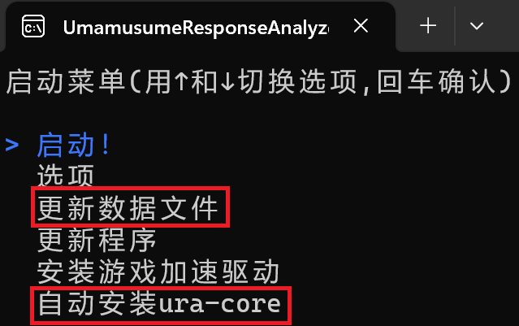

**（如果之前安装过小黑板，此步可跳过）** 更新数据文件，并自动安装ura-core， **不要"更新程序"**

若更新数据文件失败，则在"选项"里关闭"强制使用github更新"然后重试 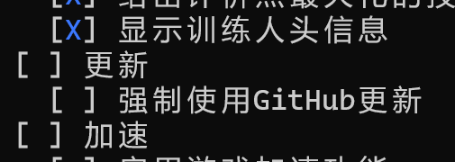

此插件与汉化插件（Trainers-Legend-G）可以兼容，如果先安装了汉化插件，在"自动安装ura-core"时会提示兼容模式

选择"启动！"后，开启游戏，若出现"**检测到ViewerID为xxxxxxxxx的帐号登录请求**"则说明安装成功

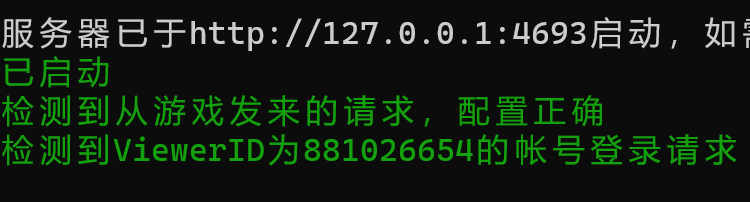

如果前一步"自动安装ura-core"失败，或者启动游戏并进入主界面后没有出现这一行字，可以手动安装ura-core，方法如下：

找到游戏所在文件夹（这个文件夹下有 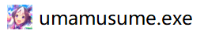等文件），然后将 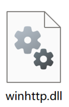复制到这个文件夹里。

  
## c) 开启ai

双击打开UmaAi.exe 

第一次打开时会出现如下提示，是正常现象， **育成开始后** 才会正常显示

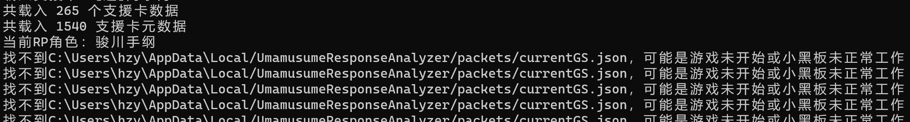

若出现下图的界面，说明成功运行

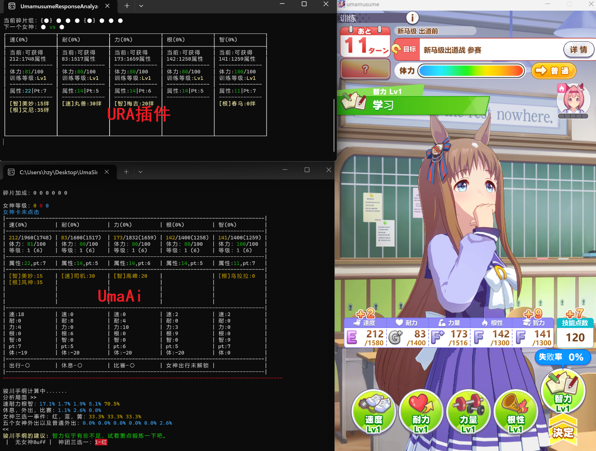

若出现 **类似下图的乱码** ，请双击打开"修复不显示颜色（[0m乱码）（无此问题不要点）.reg" 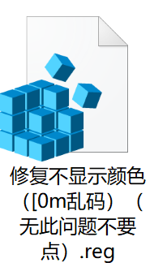

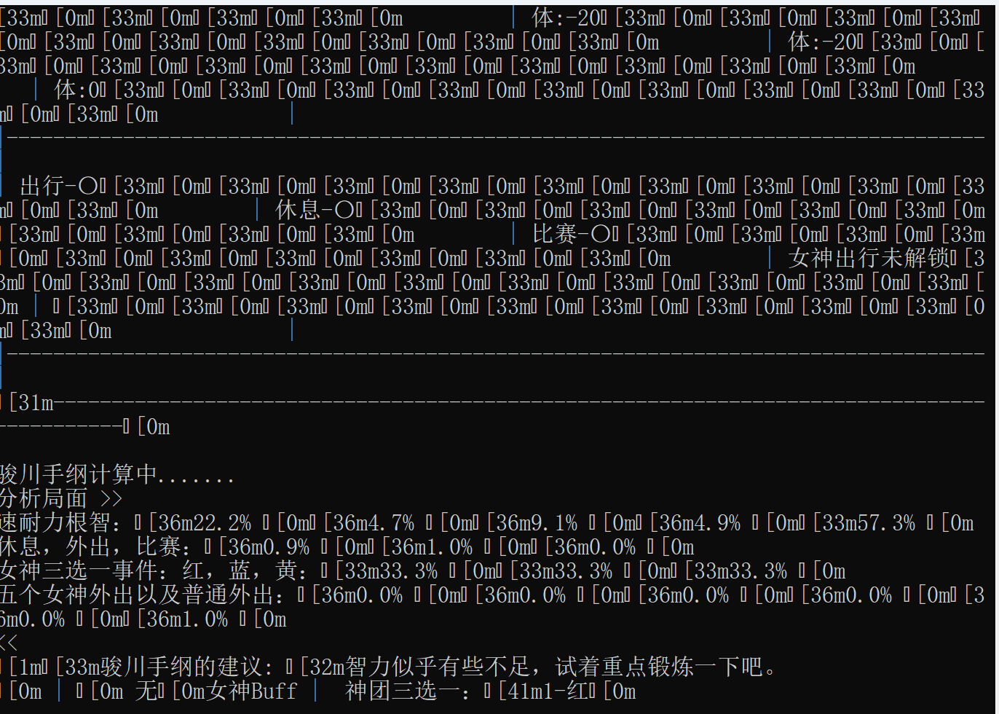

若提示“未知马娘”或“未知支援卡”（如下图），可能是马娘和支援卡太新还未收录，请等待作者更新数据发布新版本后下载。更新数据时只需要替换db目录中的同名文件即可，不需要重装AI

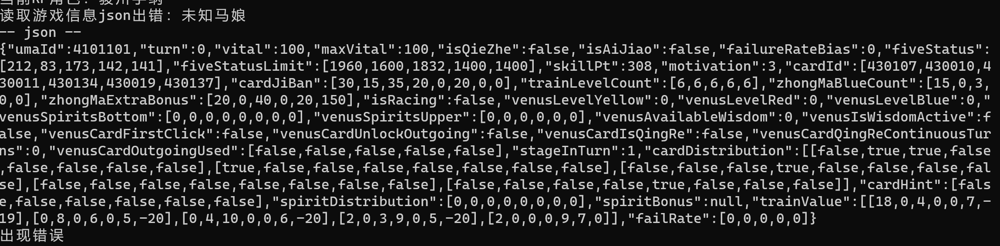

# 5.使用

## a) AI数据解读

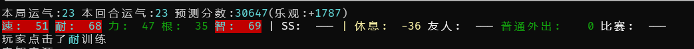

**推荐的训练** ：AI会给每项训练（包括出行、比赛和休息）的价值打分，评分最高的选项**标红**作为推荐选项。如果有多项训练标红，说明都差不多，可以自行选择。

**运气** ："本局"是当前预测的最终评分，"本回合"是此回合相比上回合的预测分变化。"乐观"是之后回合的随机波动幅度标准差（意即95%的局评分会在2倍标准差范围以内）。

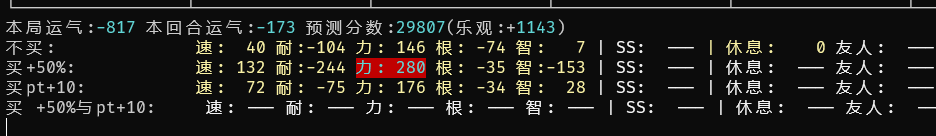

远征期间如上图所示：

**不买、买+50%、买pt+10、买50%和pt+10**：“买+50%”表示买对应训练的3级课程，增加远征期间50%训练效果的Buff，“买PT+10”表示买左下角的pt+10三级课程。在第三年远征还会出现**买体力-20%**的选项，以此类推。

相比蒙特卡洛，神经网络版在此时的决策会更加准确。

   
## b) 各种参数与设置

用记事本打开aiConfig.json，如下图所示

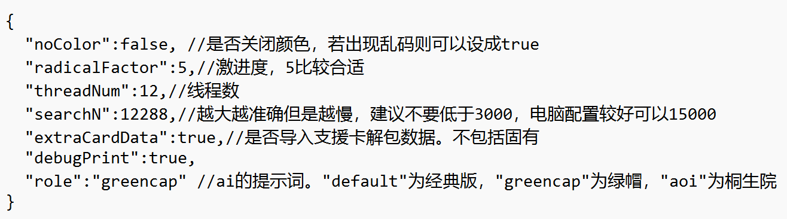

**radicalFactor** ：激进度。激进度表示了ai对这局运气的自信程度。激进度=0表示平均（不保守也不激进），但不可以设负数。如果打算养很多局冲上限，可以设较高的激进度，但建议不要超过10。默认值5适合大部分凹分情况。

**eventStrength**：事件强度，表示育成事件平均可以白嫖多少属性和PT，默认为20。如果设置过高，会导致初始评分上升但运气分下降（AI发现实际事件没有预想中那么强），反之会导致初始评分降低但运气分提升。建议根据实际情况调整，老卡组可调到15-16。

**removeDebuff5**：第二次凯旋门前是否需要消除智力debuff，默认为False

**removeDebuff7**：第二次凯旋门前是否需要消除“强心脏”debuff，默认为True，可以根据实际情况调整。

**threadNum** ：AI使用的cpu线程数。非神经网络建议设成自己的CPU线程数减2，使用神经网络应保持默认值4。

**batchSize**：默认为512。必须是2^n，会影响占用显存大小（默认时占用约2GB显存），好显卡可以调高，注意searchN >= batchSize * threadNum

**searchN** ：蒙特卡洛计算量（程序内部模拟育成的局数）。**该参数的值和Ai计算耗时成正比**，不使用神经网络建议8000，使用神经网络建议设成2000。注意如果增大了radicalFactor或者batchSize，需要成比例增加searchN

**searchDepth**：蒙特卡洛深度，神经网络默认是5（如果调大，searchN也得正比于searchDepth，速度慢很多），**非神经网络必须设置为67（游戏回合数）**

**useWebSocket**：默认使用websocket与小黑板通信，如果websocket无法启动，则可以设置该选项为false，改为使用文件通信。

**role** ：ai的提示词风格，暂时有三种：default（经典版），greencap（骏川手纲），aoi（桐生院），可以在db/roleplay.json里修改或增添。

  
## c) 注意事项

1. 由于使用了蒙特卡洛算法，ai的计算有 **随机误差** （比如，重启一下ai，计算结果与上一次的通常会有一定的偏差，这是正常现象）。计算量越大，激进度越低，随机误差越小。

2. **对于[智]目白高峰等固有词条涉及到技能的支援卡（下图）**，AI计算时认为其效果在第一年底会达到满值。实际育成中需要自己购买技能以达到固有条件，否则AI发现实际训练强度不如预测值，会导致运气分持续下降

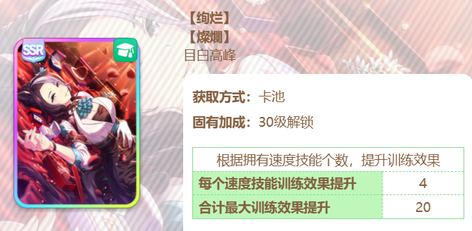

# 8.算法

在育成模拟器里通过蒙特卡洛法估测出来每个选项的平均最终分数。

## 育成模拟器

游戏机制和各种计算公式尽可能逼近真实育成（主要在game.cpp里）。

游戏机制和公式，参考如下文档：

[https://wiki.biligame.com/umamusume/%E5%9F%BA%E7%A1%80%E8%AE%AD%E7%BB%83%E6%8F%90%E5%8D%87%E5%80%BC](https://wiki.biligame.com/umamusume/%E5%9F%BA%E7%A1%80%E8%AE%AD%E7%BB%83%E6%8F%90%E5%8D%87%E5%80%BC)

[https://wiki.biligame.com/umamusume/%E5%89%A7%E6%9C%AC%22%E5%A4%A7%E5%B8%88%E6%9D%AF%22%E7%AE%80%E4%BB%8B](https://wiki.biligame.com/umamusume/%E5%89%A7%E6%9C%AC%22%E5%A4%A7%E5%B8%88%E6%9D%AF%22%E7%AE%80%E4%BB%8B)

[https://ogatetsu.shop/entry/2023/03/26/support-card-compare-tool](https://ogatetsu.shop/entry/2023/03/26/support-card-compare-tool)

除此以外还有一些纠错与实测

## 手写逻辑

Evaluator.cpp里，对每个训练的属性、体力、pt、碎片、女神等进行简单估分并相加，对休息/外出也打分，选出分数最高的训练（或者休息外出）。

## 神经网络（多层感知机）

## 蒙特卡洛法

小黑板将游戏中当前回合训练信息（当前属性、体力、人头分配、每个训练加的属性以及pt以及体力消耗等）通过一个json文件传递给ai。

ai在育成模拟器中还原当前游戏状态。在模拟器里模拟点击某个训练，并使用"手写逻辑"一直模拟育成到最后一个回合，获得最终分数。对于每个训练，模拟育成searchN局（约10000，可以调节），计算平均分数。当激进度大于0时，使用加权平均分数，越高的分数使用越大的权重。

每个回合考虑如下选择，每个选择通过蒙特卡洛法计算分数，并取最大值作为推荐选项：

1.训练选哪个（速耐力根智，休息，外出，比赛，共8种）

2.外出选哪个（5种神团外出+普通外出=6种），

3.如果成功点出三选一事件，选什么颜色的碎片（3种）。

共8+6+3=17种选择。

4.如果当前回合有女神睿智，则对于开启睿智和不开启睿智，分别计算17种选择的分数，共2\*17=34种

## 存在的问题

ai做出的决策，当前回合是通过蒙特卡洛法决定的，但是下一个回合之后都是手写逻辑。手写逻辑不能考虑较复杂的策略（比如过几个回合吃红女神回体之类的），因此目前这个ai并不能思考2回合以上的策略。下个剧本如果需要较复杂的思考，会加入神经网络代替手写逻辑。